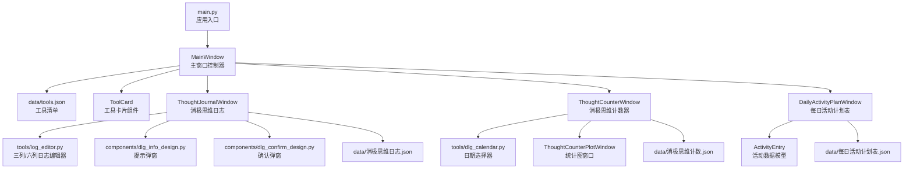
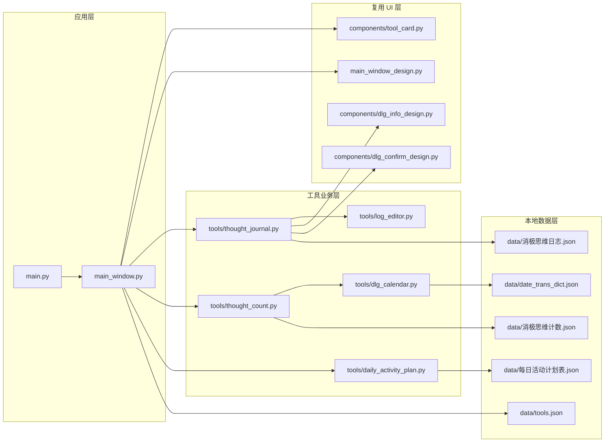
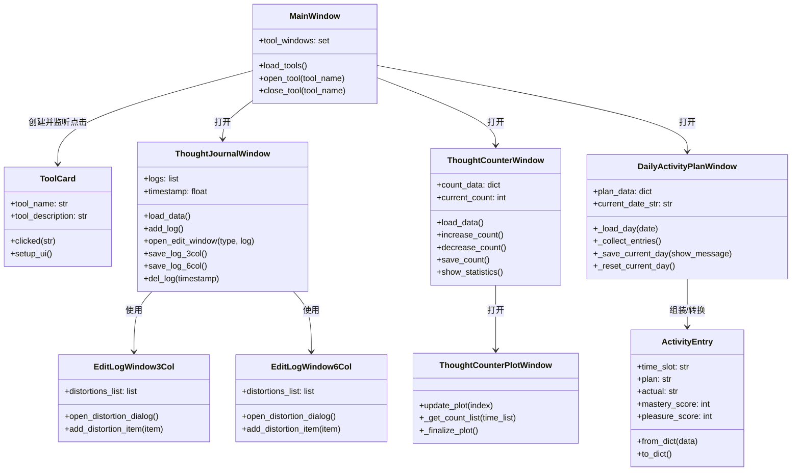
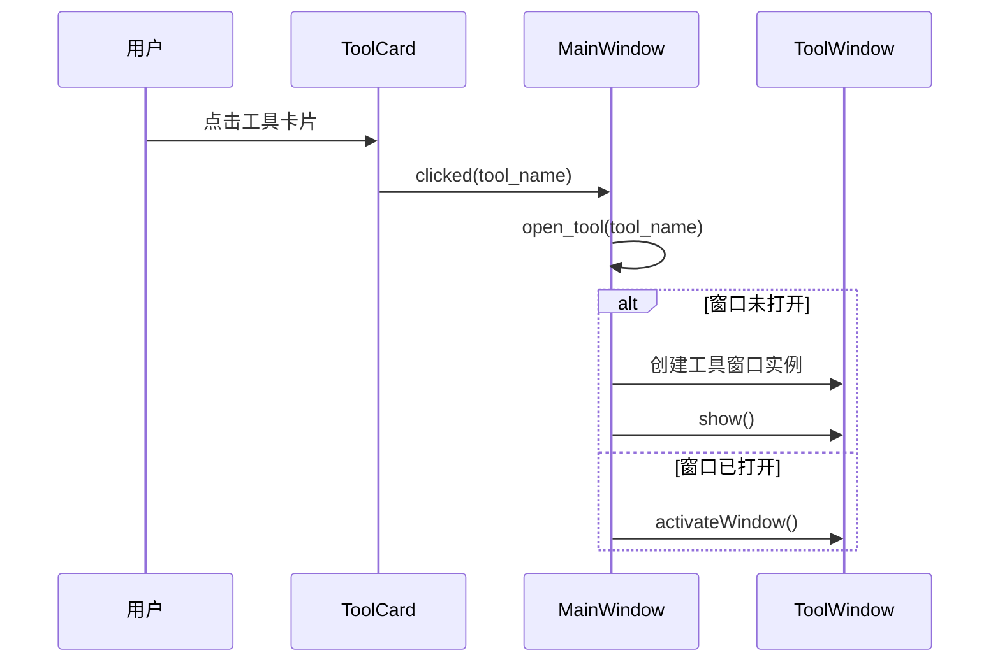
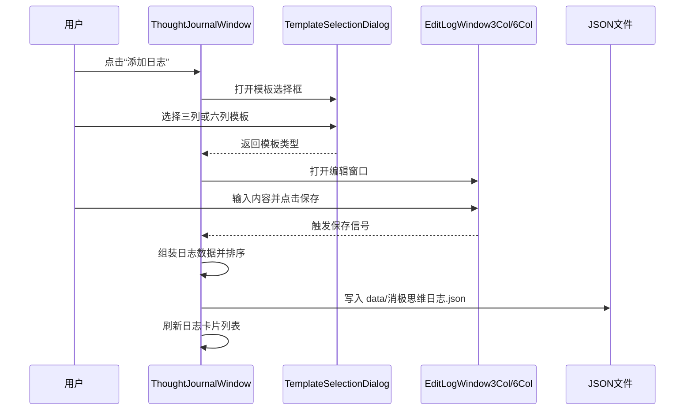
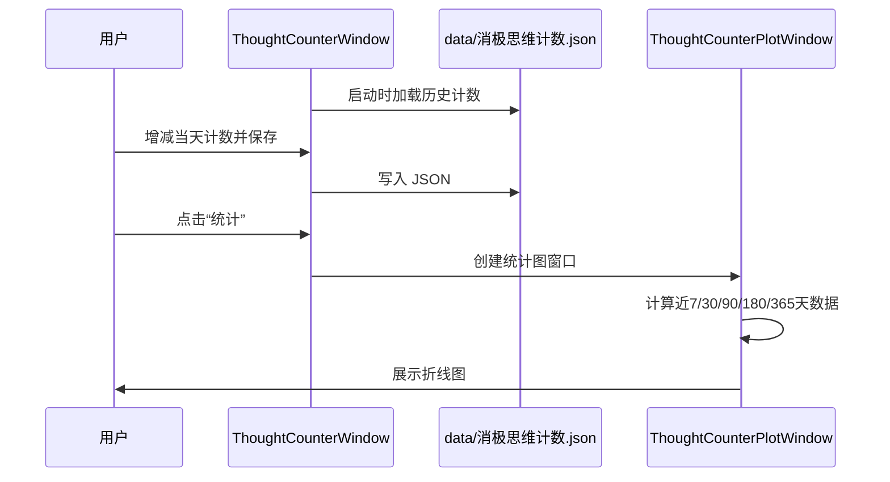
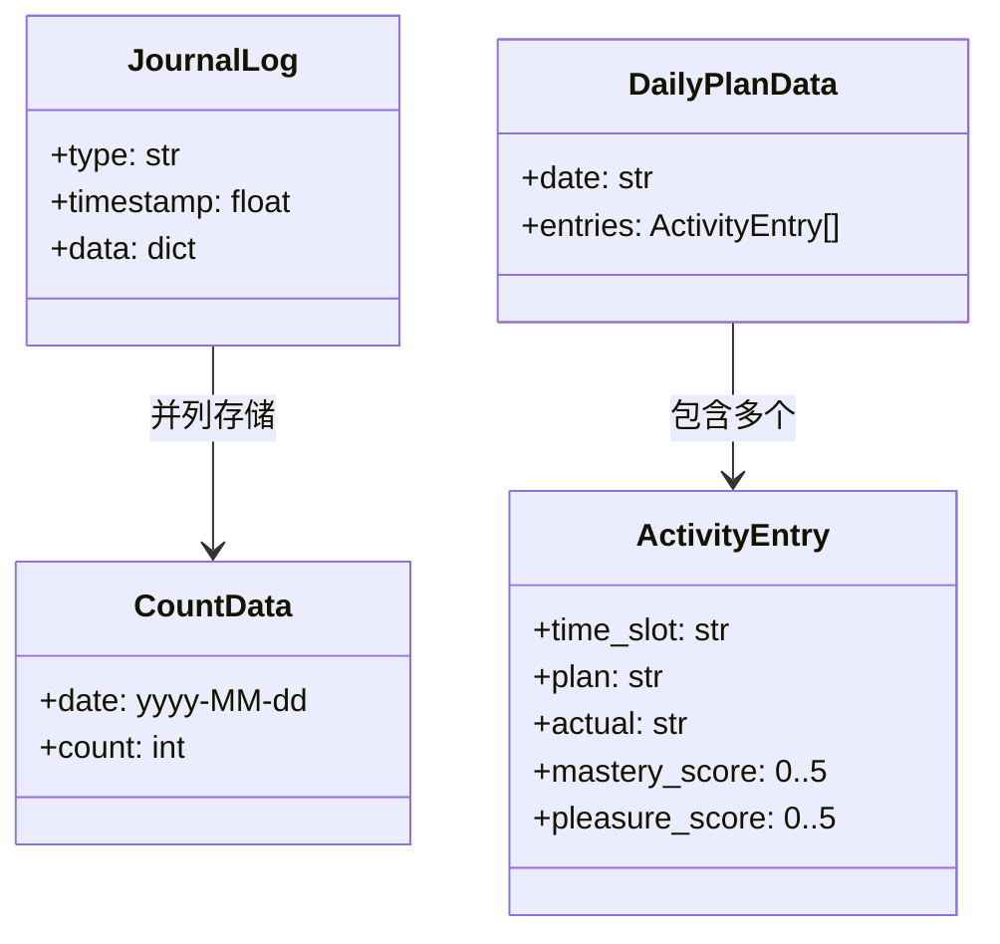

# Burns Tools

一个基于 `PySide6` 的桌面心理自助工具集，目前包含 3 个核心工具：

- 消极思维日志
- 消极思维计数器
- 每日活动计划表

项目整体是一个典型的单体桌面应用：`main.py` 负责启动，`main_window.py` 负责主窗口和工具分发，`components/` 提供复用 UI 组件，`tools/` 承载具体业务工具，`data/` 保存 JSON 数据。

## 快速理解

| 模块 | 作用 |
| :-- | :-- |
| `main.py` | 应用入口，创建 `QApplication`，启动主窗口 |
| `main_window.py` | 主界面控制器，读取工具配置、渲染卡片、打开工具窗口 |
| `components/` | 通用组件，如工具卡片、确认弹窗、提示弹窗 |
| `tools/` | 业务工具模块，如日志、计数器、活动计划 |
| `data/` | 本地 JSON 数据存储与辅助字典 |
| `tests/` | 实验脚本和功能验证脚本 |

## 系统架构图

## 目录分层图

## 核心类图

## 主流程时序图

### 1. 从主页打开工具

### 2. 消极思维日志保存流程

### 3. 消极思维计数器统计流程

## 数据模型图

## 当前架构特点

- 优点：结构直观，入口清晰，适合小型桌面工具集快速迭代。
- 优点：每个工具基本独立，便于继续新增新的心理辅助小工具。
- 优点：数据采用本地 JSON，开发和调试成本低。
- 可改进点：业务逻辑、UI 逻辑、存储逻辑目前仍有一定耦合，后续可抽出 `service` 或 `repository` 层。
- 可改进点：工具打开逻辑现在依赖 `if/elif` 分发，后续可以改为注册表模式。
- 可改进点：`tests/` 目前更像实验脚本，尚未形成自动化测试体系。

## 新人阅读建议

推荐按下面顺序阅读代码：

1. `main.py`
2. `main_window.py`
3. `components/tool_card.py`
4. `tools/thought_journal.py`
5. `tools/thought_count.py`
6. `tools/daily_activity_plan.py`

这样可以先看清“应用如何启动”，再理解“主窗口如何分发工具”，最后再分别进入各个业务工具内部。
